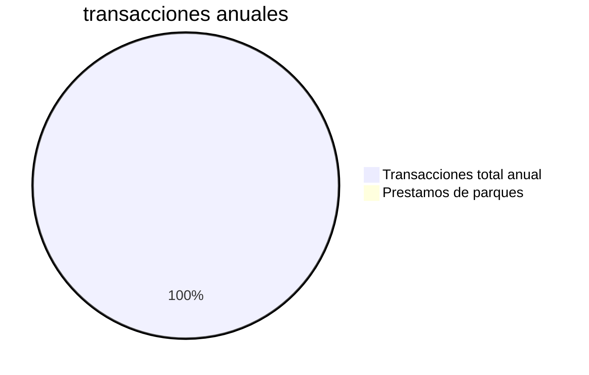

---
{"dg-publish":true,"permalink":"/alcaldia-de-pereira/tramites-implementados/prestamos-de-parques-o-escenarios-deportivos/","tags":["SecretaríaDeporte"]}
---

>Obtener el préstamo o alquiler de los parques, estadios y/o escenarios deportivos Municipales o Distritales para la realización de espectáculos públicos de las artes escénicas. Los estadios o  escenarios deportivos no se prestarán más de una vez al mes y la duración del espectáculo no podrá ser mayor a 4 días

# Ficha técnica del trámite:

- [ ] ¿Requiere pago?  
- [x] Frecuencia anual de 12 solicitudes
- [ ] ¿Requiere integración?
- [x] ¿Requiere expedir certificado?
- [x] Personalizaciones
- [x] Activado en producción desde 6/08/2021
- [x] Url de producción: https://www.pereira.gov.co/gfiles/7/tramitevirtual/

# Flujo de proceso

