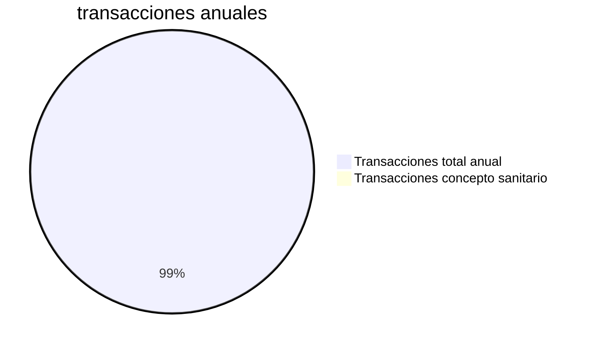
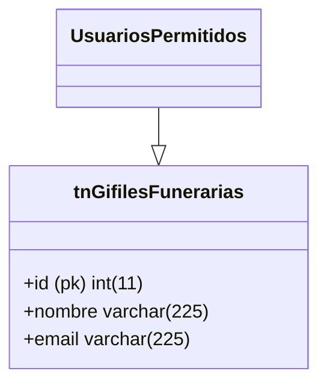
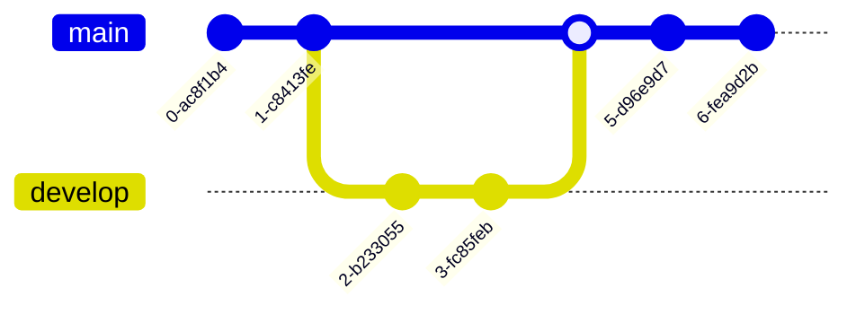

---
{"dg-publish":true,"permalink":"/alcaldia-de-pereira/tramites-implementados/tramite-beneficio-predial/"}
---

>Descuento para el pago predial del siguiente año.

# Ficha técnica del trámite:

- [ ] ¿Requiere pago?  
- [x] Frecuencia anual de 1560 solicitudes
- [ ] ¿Requiere integración?
- [x] ¿Requiere expedir certificado?
- [x] Personalizaciones
- [x] Activado en producción desde 6/08/2021
- [x] Url de producción: https://www.pereira.gov.co/gfiles/47/tramitevirtual/





## Flujo de proceso:


# Historia de Usuario #BeneficioPredial


## Diagrama de clase: 





*Personalización*, para el pre-procesamiento donde valida la correcta estructura y extensión del archivo CSV:

``` javascript

# Leer la primera línea (encabezados)
        encabezados = next(lector_csv)
        
        # Verificar la estructura de los encabezados
        if len(encabezados) != 3 or encabezados != ['columna1', 'columna2', 'columna3']:
            raise ValueError("La estructura del archivo CSV es incorrecta.")
        
        # Continuar con la carga y procesamiento del archivo
       # Agregar la lógica para procesar cada fila del archivo
        
        for fila in lector_csv:
            # Procesar la fila del archivo
            # Imprimir los valores de cada columna
            
            columna1 = fila[0]
            columna2 = fila[1]
            columna3 = fila[2]
            
      print(f"Valor columna1: {columna1}, Valor columna2: {columna2}, Valor columna3: {columna3}")

``` 


Control de versiones:





