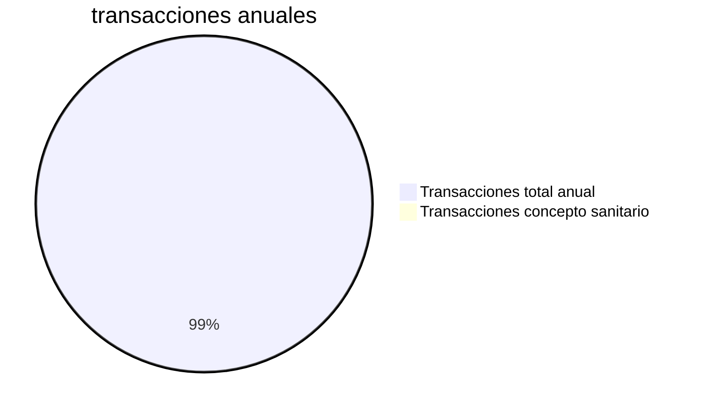

---
{"dg-publish":true,"permalink":"/alcaldia-de-pereira/tramites-implementados/tramite-concepto-sanitario/"}
---

>Descripción: Acreditar el cumplimiento de las normas sanitarias y condiciones de salubridad.

# Ficha técnica del trámite:

- [ ] ¿Requiere pago?  
- [x] Frecuencia anual de 312 solicitudes
- [ ] ¿Requiere integración?
- [x] ¿Requiere expedir certificado?
- [ ] Personalizaciones
- [x] Activado en producción desde 6/08/2021
- [x] Url de producción: https://www.pereira.gov.co/feedback/28

## Flujo de proceso:

