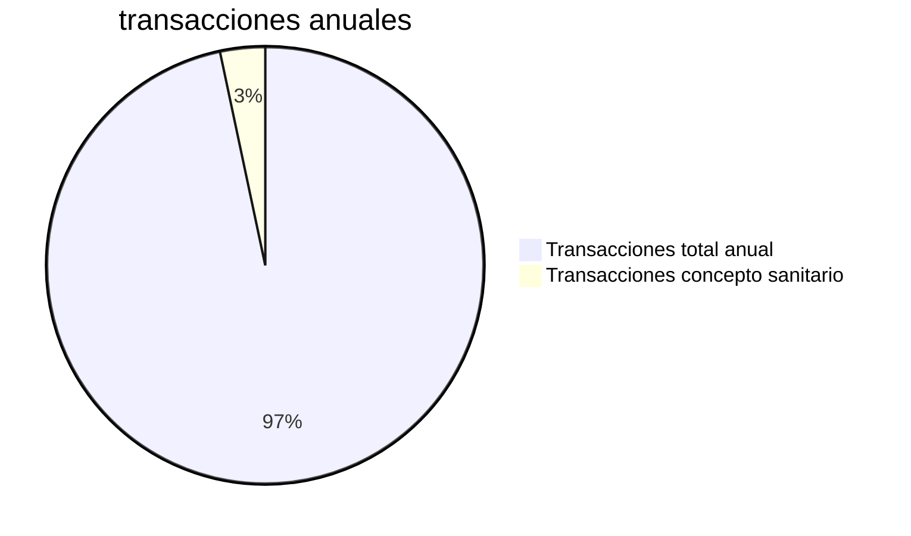
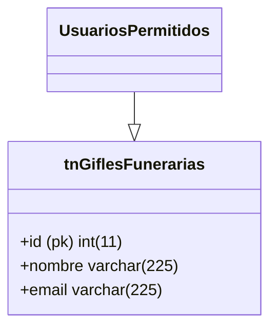
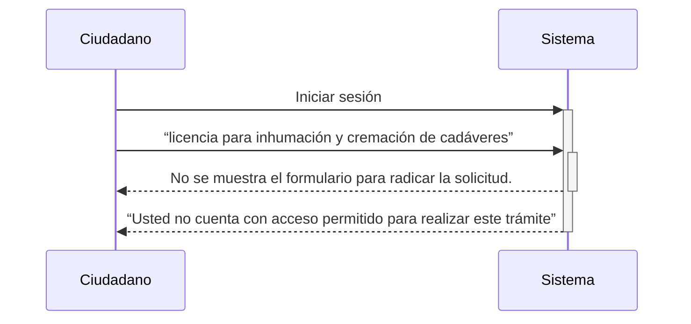

---
{"dg-publish":true,"permalink":"/alcaldia-de-pereira/tramites-implementados/tramite-licencia-de-cremacion-e-inhumacion-de-cadaveres/"}
---

>Autorización para enterrar o depositar cadáveres, restos óseos y partes humanas en los cementerios.

# Ficha técnica del trámite:

- [ ] ¿Requiere pago?  
- [x] Frecuencia anual de 1560 solicitudes
- [ ] ¿Requiere integración?
- [x] ¿Requiere expedir certificado?
- [x] Personalizaciones
- [x] Activado en producción desde 6/08/2021
- [x] Url de producción: https://www.pereira.gov.co/gfiles/20/tramitevirtual/

# Flujo de proceso

# Historia de Usuario #LicenciaImhumación

## Diagrama de clase: 

## Lógica funcional:

